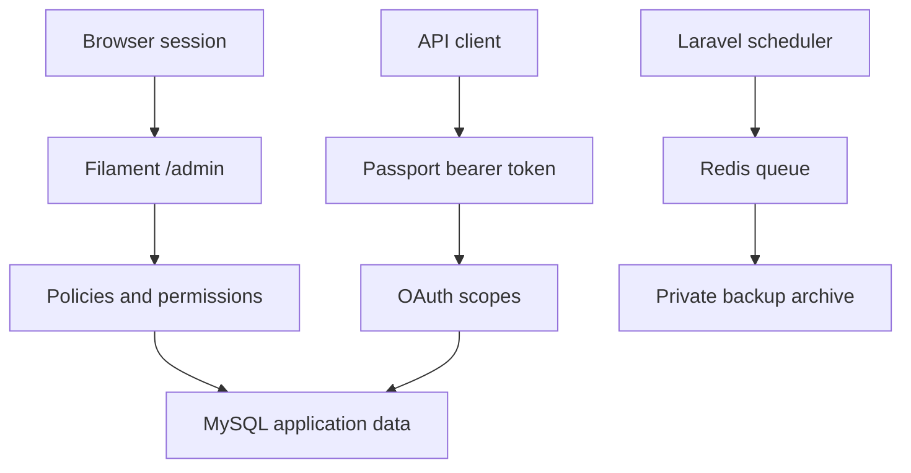

# Architecture

## Application shape

This repository is one Laravel application with a modular domain layout. Laravel's normal `app/`, `routes/`, `config/`, `database/`, and `resources/` directories hold the application shell and shared infrastructure. Domain code is grouped under `Modules/` and is autoloaded from each module's own `composer.json`; the root application does not declare a catch-all `Modules/` PSR-4 mapping. See [Modules](modules.md) for the module contract.

The Filament panel and API use different authentication boundaries. Browser access uses Laravel's session guard and Filament checks that a user is active and has `access.admin`. API calls use Passport tokens, endpoint scopes, and any application permission required by that endpoint. OAuth scopes authorize a token for a route; they do not add roles or permissions to the user.

## Modules and panel composition

`Core`, `IAM`, and `System` are the baseline modules. The module activator protects these modules from disablement. Filament's Coolsam Modules integration composes module plugins into the admin panel. Plugin discovery must honor the module activation state: Composer can autoload module classes even if the module is disabled, so class discoverability is not proof that its UI should be registered.

Keep cross-cutting infrastructure in the root application and put module-owned policies, admin resources, commands, migrations, settings, and tests in the module that owns them. Add a dependency between modules only when one module uses another module's public behavior; avoid reaching into private implementation paths.

## Data and background work

MySQL is the application database. Redis is the default cache, session, and queue service in `.env.example`; Scout uses its database driver by default. The search layer can be reconfigured for a supported Scout engine, but that requires the corresponding endpoint, credentials, and index setup.

System settings are persisted in the database and applied to HTTP requests through the shared settings layer. The saved timezone and locale are request-scoped; scheduled backup times use the deployment's `APP_TIMEZONE` and `BACKUP_RUN_AT` / `BACKUP_CLEAN_AT` configuration. Activity records are persisted by Spatie Activitylog. Administrative backup requests dispatch work to the `backups` queue and write archives to the private local backup disk; scheduling remains disabled until explicitly enabled. Backup storage is separate from publicly served files. See [backup operations](backup.md).

## OAuth and API

Passport issues user tokens for interactive clients and client-credentials tokens for service integrations. Authorization code clients use PKCE; service clients are constrained by `system:read`. API routes are versioned under `/api/v1`. The health endpoint returns only a generic availability response and does not disclose database, Redis, or other dependency details.

## AI and MCP

The Laravel AI SDK integration is optional at runtime and reads provider secrets from the environment. Tests fake the agent so normal test runs do not call external providers. The local MCP server uses standard input/output and exposes a narrow system-information tool only. No HTTP MCP listener is registered. See [AI](ai.md) and [MCP](mcp.md).

## Environment boundaries

Keep `APP_KEY`, Passport signing keys, OAuth client secrets, mail credentials, AI provider keys, and production database/Redis credentials in the deployment secret store. Never put real values in tracked files. Production should use `APP_DEBUG=false`, HTTPS cookies, private backup storage, a least-privilege database account, and separate web, queue-worker, and scheduler processes where the deployment platform supports them.
